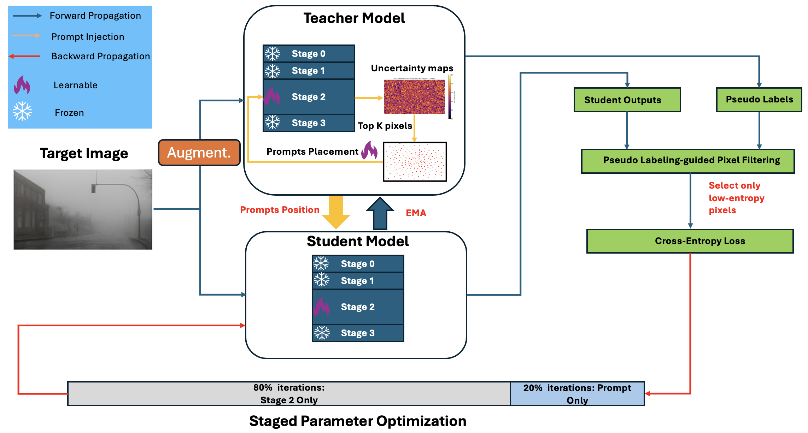

# PromptCAL
Code for our paper: "PromptCAL: Entropy-Calibrated and Prompt-Tuned Test-Time Adaptation for Semantic Segmentation" (IEEE SMC2025)

## Overview

<p align="center">
  
</p>

## Prepare Dataset and Checkpoints
Follow the SVDP reposory https://github.com/Anonymous-012/SVDP


## Reproduce

```bash
bash bash/promptcal.sh
```

## Citation
```bibtex

@inproceedings{4785b25ca57940f09ac7de5cf1b2b033,
title = "PromptCAL: Entropy-Calibrated and Prompt-Tunes Test Time Adaptation for Semantic Segmentation",
author = "Jixiang Lei and Franz Pernkopf",
year = "2025",
language = "English",
booktitle = "IEEE SMC",

}
```

## Acknowledgement

This repository is based on and derived from the implementation accompanying
the paper **SVDP** (https://github.com/Anonymous-012/SVDP).
